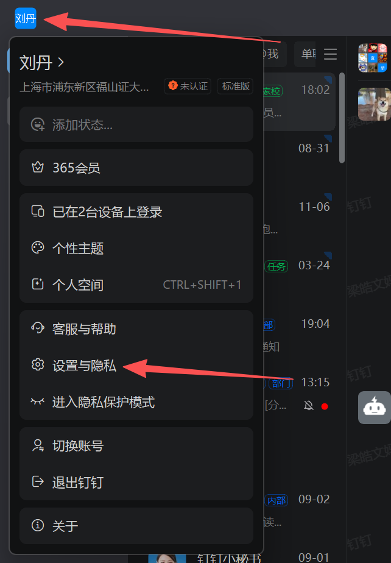
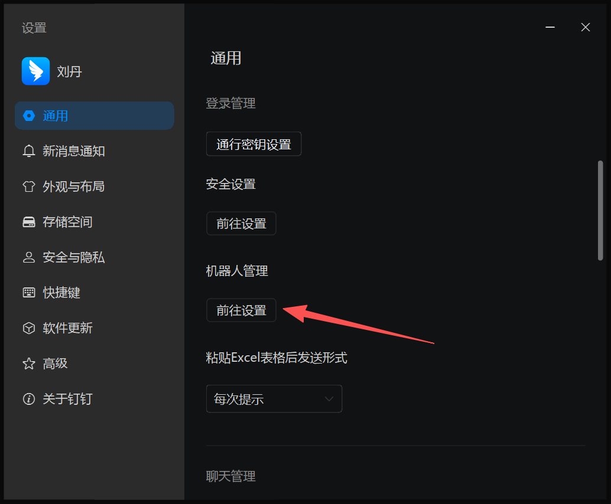
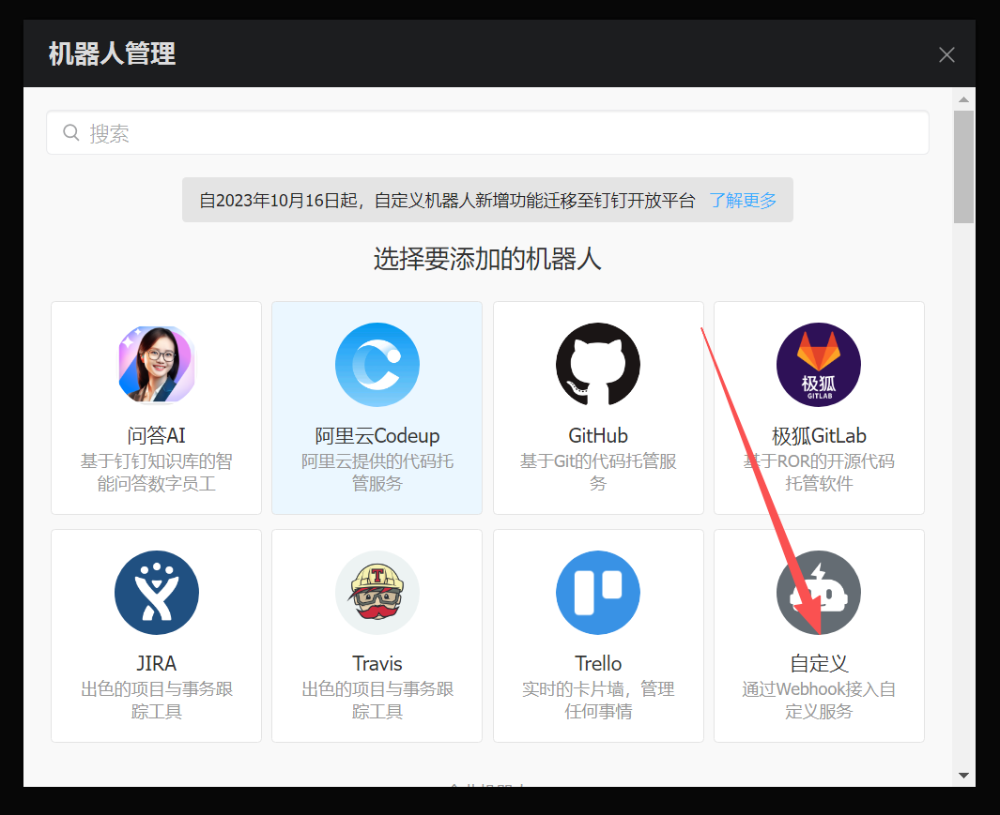
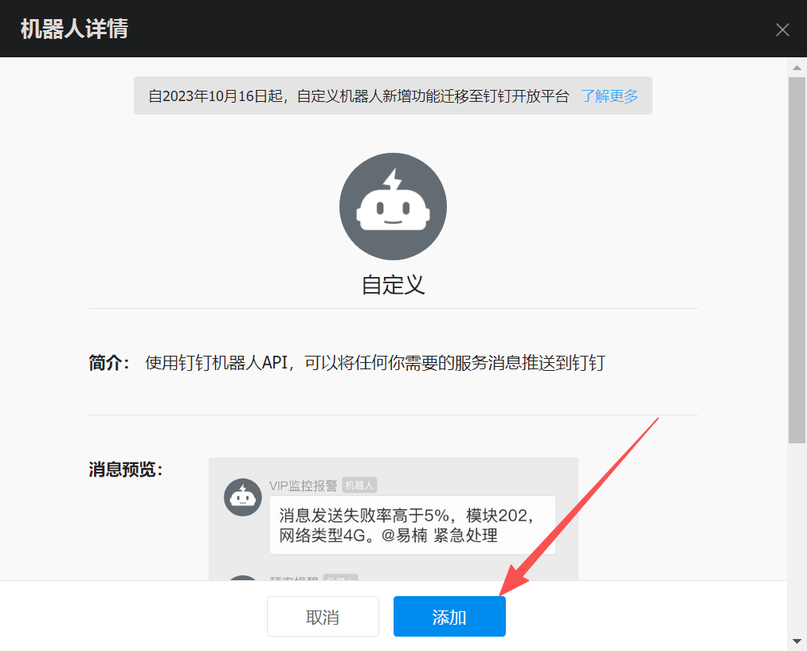
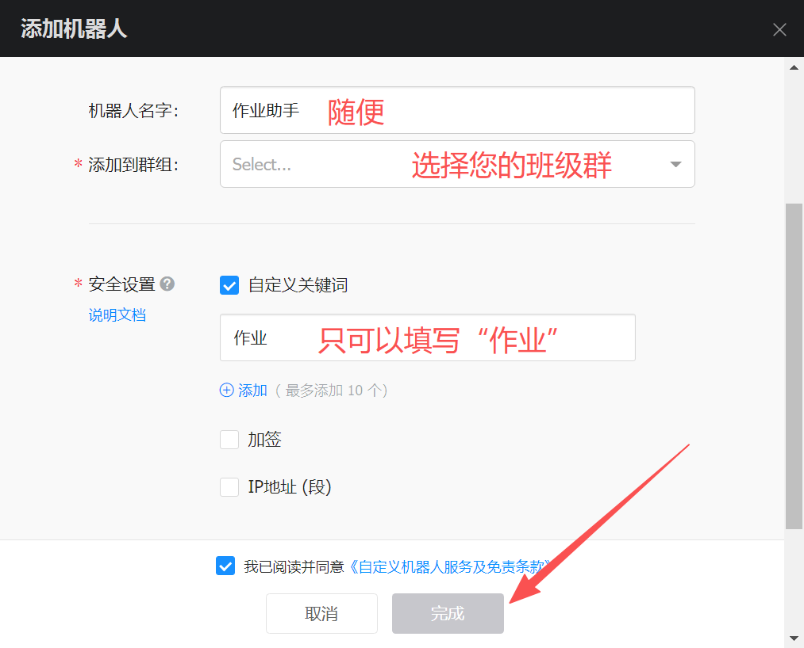
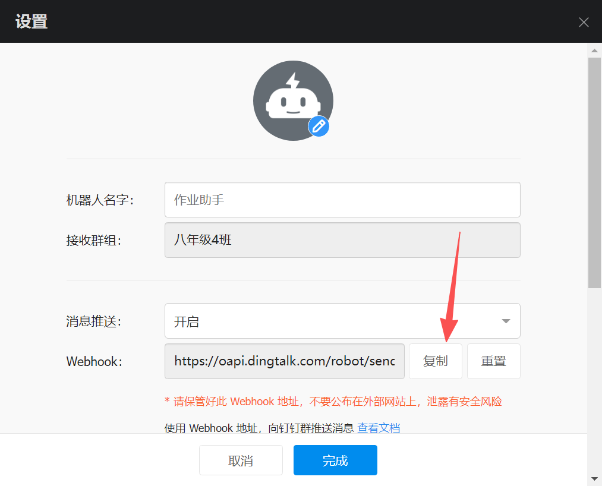
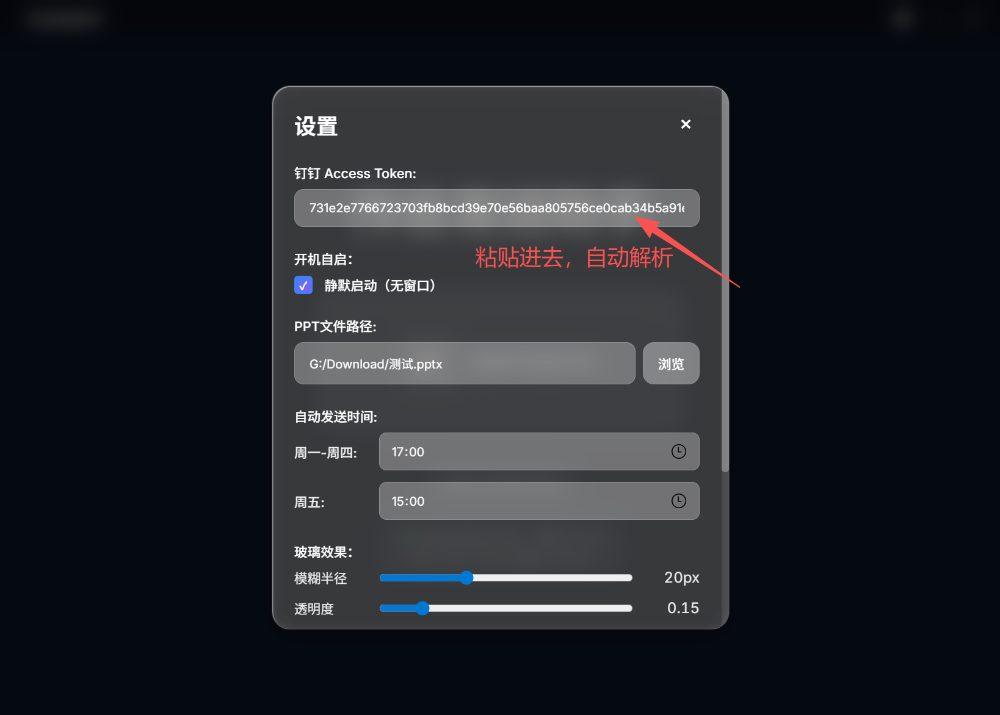
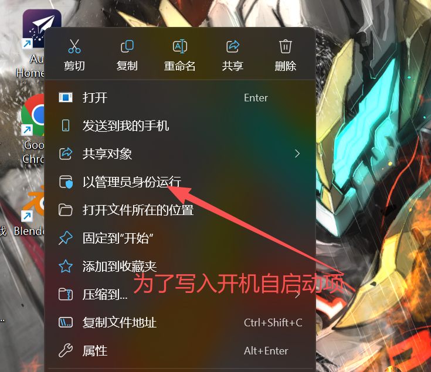

# Auto Homework Sender 使用指南

## 安装

运行安装包 `AutoHomework_Setup_vX.Y.Z.exe` 完成安装。

## 首次配置

1. 点击钉钉头像 → 进入“设置与隐私”。
   
   
2. 打开“机器人管理” → “前往设置”。
   
   
3. 选择“自定义（Webhook）”。
   
   
4. 机器人名称任意，添加到群组自行选择。
   
   
5. 安全设置仅勾选“自定义关键词”，并输入：作业。
   
   
6. 完成后复制 Webhook 链接，回到软件设置页粘贴即可（会自动解析）。
   
   

### 软件内配置（演示）

1. 在主界面点击右上角齿轮打开设置。
   
   

2. 将完整 Webhook 粘贴到 “钉钉 Access Token”，会自动解析为纯 token；选择 PPT 文件路径、设置自动发送时间，保存。
   
   

3. 如需开机自启，首次建议“以管理员身份运行”后在设置中勾选开机自启并保存。
   
   

## 单实例与后台运行

- 再次启动会唤起已有窗口；关闭按钮会隐藏窗口，程序持续在后台运行。
- “彻底退出”在设置页。

## 自动更新

- 程序会调用 `/api/update/check` 获取 GitHub Releases 最新版本信息；
- 后续可在前端添加“有更新”提示按钮跳转下载（默认不强更）。

## 常见问题

- 开机不自启动：可能没有注册表写入权限。右键以管理员身份运行应用，再在设置中保存一次。
- 其它问题：还是来八(4)班问问我吧~

# Auto Homework Sender - 智能作业自动发送助手

## 软件简介

Auto Homework Sender 是一款智能化的作业管理和自动发送工具，专为学生和教育工作者设计。

## 主要功能

### 📝 智能PPT解析
- 自动解析PowerPoint文件内容
- 智能提取最后一页作为作业内容
- 支持图片和文字混合内容

### ⏰ 定时自动发送
- 灵活的定时发送设置
- 支持每日、每周定时任务
- 智能避重发送机制

### 🎨 现代化界面
- 精美的玻璃拟态设计风格
- 支持浅色/深色主题切换
- Windows原生标题栏体验
- 流畅的动画效果

### 🔒 安全可靠
- 本地数据存储，保护隐私
- 安全的钉钉API集成
- 智能错误处理和重试机制

## 快速开始

### 首次使用

1. **配置钉钉Token**
   - 点击设置按钮
   - 输入您的钉钉访问令牌
   - 软件已预配置默认Token，可直接使用

2. **选择PPT文件**
   - 点击"选择PPT文件"按钮
   - 浏览并选择要发送的PowerPoint文件
   - 软件会记住您的选择

3. **设置定时发送**
   - 在时间设置区域输入发送时间
   - 格式：HH:MM（如：14:30）
   - 点击"启动定时发送"

### 主要操作

- **手动发送**：点击"发送作业"按钮立即发送
- **主题切换**：点击右上角主题按钮切换浅色/深色模式
- **查看状态**：底部状态栏显示当前操作状态
- **停止定时**：再次点击定时按钮可停止自动发送

## 系统要求

- **操作系统**：Windows 10/11 (x64)
- **内存**：至少 512MB 可用内存
- **磁盘空间**：50MB 安装空间
- **网络**：需要网络连接以访问钉钉API

## 技术特性

- **现代化架构**：基于 Python + WebView 混合架构
- **高性能**：优化的启动速度和运行性能
- **跨平台兼容**：核心功能支持多平台部署
- **模块化设计**：易于维护和功能扩展

## 注意事项

1. **Token安全**：请妥善保管您的钉钉访问令牌
2. **文件格式**：目前支持 .pptx 和 .ppt 格式
3. **网络连接**：发送功能需要稳定的网络连接
4. **权限要求**：首次运行可能需要防火墙权限

## 故障排除

### 常见问题

**Q: 软件无法启动？**
A: 请检查是否安装了最新的 Microsoft Visual C++ 运行库

**Q: 无法发送作业？**
A: 请检查网络连接和钉钉Token是否正确配置

**Q: PPT解析失败？**
A: 请确保PPT文件未损坏且格式受支持

**Q: 定时发送不工作？**
A: 请确保时间格式正确（HH:MM）且软件保持运行

### 获取帮助

如果您遇到问题：
1. 查看软件内的状态提示
2. 检查网络连接和配置
3. 重启软件尝试解决
4. 联系技术支持：support@autohomework.com

## 更新日志

### v1.0.0 (2025-07-18)
- 初始版本发布
- 完整的PPT解析和发送功能
- 现代化UI界面
- 定时发送功能
- 双主题支持

## 版权信息

Copyright (C) 2025 Auto Homework Team
Licensed under Custom License Agreement

---

感谢使用 Auto Homework Sender！
如果您觉得这个软件有用，请推荐给您的朋友。
